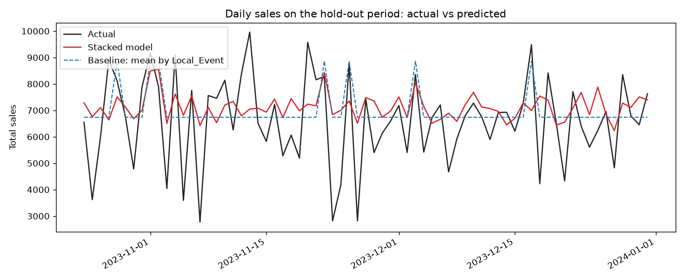

# 🍟 McDonald's Sales Prediction Canada

This project predicts daily sales for McDonald's Canada using historical data, including temperature, weather, holidays, and sales trends. It reflects my journey from working as a Crew Member at McDonald's to becoming a data analyst by applying machine learning and data science skills.

## 🧠 Project Highlights

- Cleans and preprocesses messy Date and weather data
- Feature engineering: lag features, holiday flagging (Ontario calendar via `holidays`), weather influence
- One-hot encoding and scaling inside a pipeline
- XGBoost + Linear Regression in a Stacking Regressor
- Hyperparameter tuning using Optuna (seeded, reproducible)
- Honest evaluation: strong baselines + walk-forward cross-validation
- Exports predictions, a plot, and the trained model

## 📁 Folder Structure

```
mcdonalds-sales-prediction/
├── src/
│   └── sales_predictor.py        # Main Python script
├── data/
│   └── McDonalds_Canada_Sales_Data_with_Temperature.csv
├── output/
│   ├── sales_predictions_results.csv
│   ├── actual_vs_predicted.png
│   └── stacked_sales_model.pkl   # generated, not committed
├── README.md
└── requirements.txt
```

> Note: The dataset file included in the repository tries to mimic real-world sales data for privacy.

## 🚀 How to Run

1. Clone this repo:
   ```bash
   git clone https://github.com/dhruvdesai14/mcdonalds-sales-prediction.git
   cd mcdonalds-sales-prediction
   ```

2. Install dependencies:
   ```bash
   pip install -r requirements.txt
   ```

3. Run the script (from any directory; paths resolve relative to the repo):
   ```bash
   python src/sales_predictor.py
   ```

   Outputs are written to `output/`. A full run takes about 30 seconds.
## Model Performance & Data Integrity

> **Headline:** After removing all data leakage, the honest answer is that this series
> is almost unpredictable from the available features, and **a two-line rule
> ("average sales on event days vs. non-event days") matches or beats the stacked model.**
> Finding that out, rather than publishing an inflated number, is the point of this project.

### Results: chronological hold-out (last 69 days)

| Model / Baseline                         | MAE      | R²       |
|------------------------------------------|----------|----------|
| **Baseline: mean by `Local_Event`**      | **1180** | **0.114**|
| Stacked model (XGBoost + Linear)         | 1232     | 0.089    |
| Baseline: training mean                  | 1337     | −0.052   |
| Naive: yesterday                         | 2084     | −1.47    |
| Naive: same weekday last week            | 2140     | −1.30    |

### Results: walk-forward CV (5 expanding folds, mean MAE ± std)

| Model / Baseline                  | Mean MAE | Std |
|-----------------------------------|----------|-----|
| Baseline: mean by `Local_Event`   | 1260     | 182 |
| Stacked model                     | 1294     | 233 |
| Baseline: training mean           | 1325     | 218 |
| Naive: yesterday                  | 1900     | 296 |
| Naive: same weekday last week     | 1898     | 348 |

Each fold re-tunes and re-fits the model on the past only, then scores the next block of days.



### What the data says

- **Daily sales have no day-to-day memory.** The autocorrelation of `Total_Sales` is
  −0.005 at lag 1 and −0.019 at lag 7. Each day is effectively independent.
- **That makes carry-forward baselines misleading.** "Yesterday" and "last week" copy
  one noisy value into another, so they're *guaranteed* to do worse than predicting the
  average. An earlier version of this README claimed the model beat them by ~41%;
  that was true but meaningless, so the stronger baselines above were added.
- **`Local_Event` is the only real signal.** Event days average ~8,950 in sales versus
  ~6,655 on other days, and it's by far the model's top feature (~39% of XGBoost
  importance). Lag, weather, and temperature features add variance but not accuracy.
- **Conclusion:** with this dataset, a complex model doesn't earn its complexity.
  Real gains would need richer data (store traffic, promotions, hourly patterns, real
  multi-year history).

### The leakage story (three iterations)

| Version | R²    | Cause                                                                 |
|---------|-------|-----------------------------------------------------------------------|
| v1      | 0.99  | A `Big_Mac_Ratio` feature divided by the target, and same-day Big Mac sales were used directly. |
| v2      | 0.865 | Other same-day menu categories (fries, nuggets, desserts, drinks) still leaked. |
| v3      | 0.087 | All same-day components lagged to previous-day values; honest result. |

Each drop came from removing a feature that secretly contained the answer. The menu
categories make up most of `Total_Sales` (they sum to ~83% of it on average), so **any
same-day category value lets the model largely reconstruct the total instead of
forecasting it.**

### Safeguards in the current pipeline

- **No same-day target components.** Every `*_Sales` column is auto-detected and used
  only as a *previous-day* lag; a guard raises an error if any same-day sales column
  reaches the model.
- **Scaling inside the pipeline.** `StandardScaler` is fit on training data only, so
  test statistics never leak into the transform.
- **Honest tuning.** Optuna optimises against an internal chronological validation slice
  carved from the training data; the test set is untouched until final evaluation.
- **Time-ordered split + walk-forward CV.** Train on the past, test on later periods,
  across several folds so one lucky split can't drive the conclusion.
- **Strong baselines.** Every run reports a training-mean and mean-by-event baseline,
  and the verdict compares against the best one.
- **No outlier trimming.** An earlier version removed high-sales training days, which
  mostly discarded local-event days (the one real signal). It was removed.

**Known limitation:** the `StackingRegressor` uses standard 5-fold CV internally to
build its meta-features, which isn't time-ordered. With no autocorrelation in this
data the effect is negligible, but it would matter on a series with real trends.

## 📊 Output

- `output/sales_predictions_results.csv`: actual vs predicted sales for the hold-out period
- `output/actual_vs_predicted.png`: plot of actual, model, and best-baseline predictions
- `output/stacked_sales_model.pkl`: trained model (regenerated on each run, git-ignored)

## 📈 Model Metrics

After training the script prints:
- **MAE**, **MSE**, and **R²** on the hold-out set
- All baselines and a verdict against the best one
- Walk-forward CV MAE per fold, with mean and std
- Top 10 XGBoost feature importances

## 🧑‍💼 About Me

Hi, I’m Dhruv Desai, currently working at McDonald’s and transitioning into a Data Analyst role. This project represents my passion for learning and applying machine learning to real-world problems.

Let's connect on [LinkedIn](https://www.linkedin.com/in/dhruvdesai14)!

---

### 📌 Tech Stack

- Python
- Pandas, NumPy
- Scikit-Learn
- XGBoost
- Optuna
- Matplotlib
- Joblib
- holidays

---

### 📬 Contact

Feel free to reach out if you're hiring for data analyst roles or have feedback on the project!
